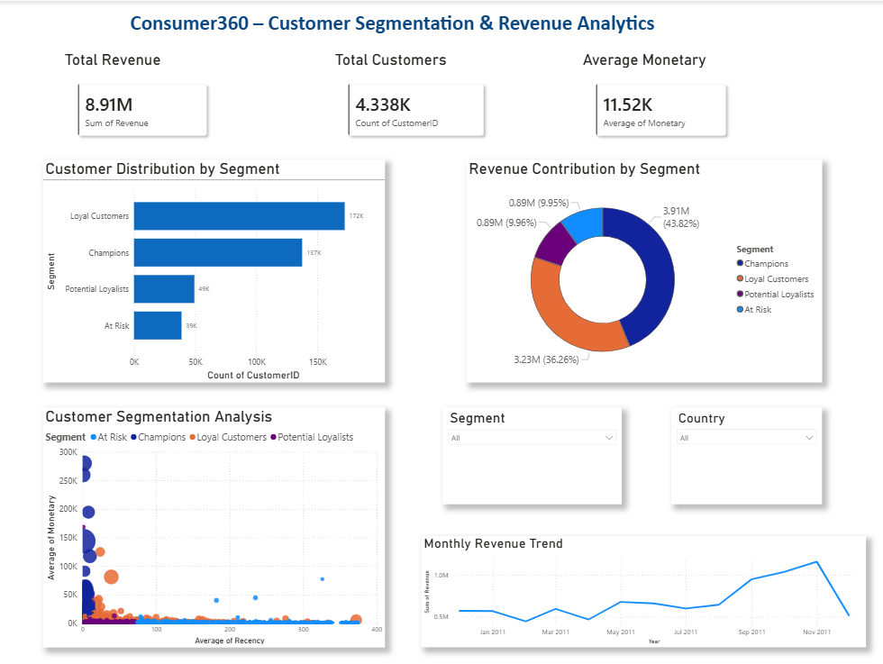

# Consumer360 – Customer Segmentation & CLV Engine

## 📌 Project Overview
Consumer360 is a retail analytics project focused on customer segmentation and business insights using transactional retail data.

The project uses:
- RFM (Recency, Frequency, Monetary) Analysis
- Customer Lifetime Value (CLV)
- Market Basket Analysis
- Cohort Analysis

to identify customer behavior patterns and improve business decision-making.

The project also includes:
- Automated analytics pipeline
- Interactive Power BI dashboard
- Business insight generation

---

## 🎯 Objectives
- Identify high-value customers (“Champions”)
- Detect churn-risk customers (“At Risk”)
- Analyze customer purchasing behavior
- Generate business insights for targeted marketing
- Build an automated analytics workflow

---

## 🗂️ Dataset
- Online Retail Transaction Dataset
- Each row represents a product purchased in a transaction

### Main Columns
- InvoiceNo
- StockCode
- Description
- Quantity
- InvoiceDate
- UnitPrice
- CustomerID
- Country

### Dataset File
```text
data/raw/Retail.csv
```

---

## ⚙️ Tech Stack
- Python (Pandas, NumPy, MLxtend)
- SQL
- Power BI
- Git & GitHub

---

# 📊 Project Workflow

## 🔹 Week 1 – Data Engineering
### Tasks Performed
- Explored and inspected dataset
- Removed null CustomerID values
- Removed invalid/negative transactions
- Created Revenue column
- Converted InvoiceDate into datetime format
- Designed SQL schema and optimization queries

### SQL Components
- Data Cleaning Queries
- Date Transformation Queries
- Index Optimization
- Star Schema Design

---

## 🔹 Week 2 – Customer Segmentation (RFM Analysis)

### Calculated Metrics
- Recency
- Frequency
- Monetary values

### Implemented Features
- RFM scoring system
- Customer segmentation
- CLV calculation
- Validation checks
- Automated data pipeline

### Customer Segments
- Champions
- Loyal Customers
- Potential Loyalists
- At Risk

### Output Files
```text
week2_analysis/data_pipeline/cleaned_data.csv
week2_analysis/segmentation/rfm_output.csv
```

---

## 🔹 Week 3 – Power BI Dashboard

Created an interactive Power BI dashboard with:
- Customer segmentation analysis
- Revenue insights
- Customer distribution
- KPI cards
- Revenue trend analysis
- RFM visualizations

### Dashboard Features
- Revenue contribution by segment
- Customer distribution analysis
- Monthly revenue trend
- Customer segmentation scatter analysis
- Interactive slicers and filters

### Dashboard Preview



---

## 🔹 Week 4 – Advanced Analytics

### Market Basket Analysis
Implemented Association Rule Mining using Apriori Algorithm to:
- Identify products frequently purchased together
- Generate association rules
- Discover customer purchasing patterns

### Cohort Analysis
Performed customer retention analysis by:
- Grouping customers based on first purchase month
- Tracking repeat customer behavior
- Understanding retention trends

### Automation Pipeline
Integrated:
- Data Cleaning
- RFM Analysis
- Market Basket Analysis
- Cohort Analysis

Run the complete pipeline using:

```bash
python week4_advanced_analytics/automation/run_pipeline.py
```

---

# 📈 Key Insights
- Champions are high-value repeat customers
- At Risk customers indicate possible churn
- Segmentation improves targeted marketing
- Market Basket Analysis helps product recommendation systems
- Cohort Analysis helps understand customer retention behavior

---

# 📁 Project Structure

```text
consumer360/

├── data/
│   ├── raw/
│   │   └── Retail.csv
│   └── processed/

├── week1_data_engineering/
│   ├── data_cleaning/
│   ├── data_inspection/
│   ├── data_transformation/
│   ├── performance_optimization/
│   └── star_schema_design/

├── week2_analysis/
│   ├── data_pipeline/
│   ├── rfm_analysis/
│   ├── segmentation/
│   └── validation/

├── week3_dashboard/
│   ├── data_preparation/
│   ├── powerbi/
│   └── visuals/

├── week4_advanced_analytics/
│   ├── market_basket/
│   ├── cohort_analysis/
│   └── automation/

├── requirements.txt
└── README.md
```

---

# ▶️ Run Full Project

```bash
python week4_advanced_analytics/automation/run_pipeline.py
```

---

# ✅ Project Outcome
Consumer360 successfully delivers:
- Automated retail analytics workflow
- Customer segmentation engine
- Churn-risk identification
- Customer behavior analysis
- Interactive business dashboard
- Advanced analytics and retention insights

The project demonstrates end-to-end data analytics implementation using SQL, Python, and Power BI.