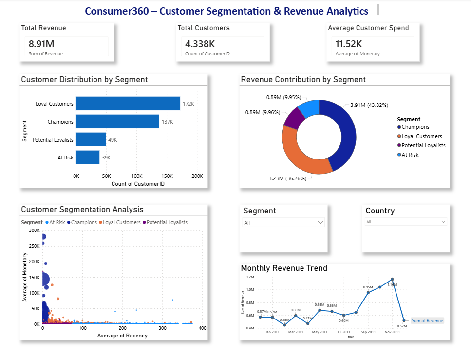
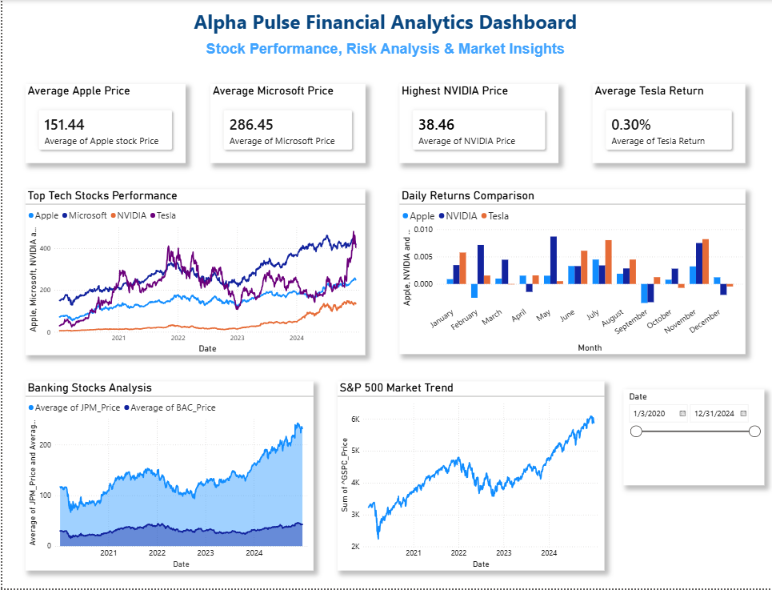

# Zaalima Internship Projects

This repository contains two end-to-end analytics projects developed using Python, Power BI, financial analytics, and business intelligence concepts.

The projects focus on:
- Customer Analytics
- Financial Analytics
- Data Visualization
- Quantitative Analysis
- Dashboard Development
- Forecasting & Risk Analysis
- Workflow Automation

---

# Repository Projects

## 1. Consumer360
### Customer Segmentation & Revenue Analytics

Consumer360 is a business intelligence project focused on customer behavior analysis and revenue insights.

### Key Features
- Customer Segmentation
- Revenue Analytics
- RFM-Based Analysis
- Customer Distribution Analysis
- Revenue Contribution Analysis
- Interactive Power BI Dashboard
- Business Insight Generation

### Technologies Used
- Python
- Pandas
- Power BI
- VS Code
- Git & GitHub

### Dashboard Preview



---

## 2. AlphaPulse
### Financial Market Analytics & Risk Analysis

AlphaPulse is a financial analytics project focused on stock market analysis, quantitative analytics, forecasting, and portfolio insights.

### Key Features
- Stock Market Data Analysis
- Daily Returns Analysis
- Correlation Heatmap
- Value at Risk (VaR)
- Monte Carlo Simulation
- Financial Dashboard Development
- Stock Forecasting
- Portfolio Optimization
- Automated Analytics Pipeline

### Technologies Used
- Python
- Pandas
- NumPy
- Matplotlib
- Power BI
- Git & GitHub

### Dashboard Preview



---

# Repository Structure

```bash
zaalima-internship/
│
├── consumer360/
│
├── alphapulse/
│
└── README.md
```

---

# Skills Demonstrated

## Data Analytics
- Data Cleaning
- Data Processing
- Data Visualization
- Dashboard Development

## Financial Analytics
- Stock Market Analysis
- Risk Analysis
- Portfolio Analytics
- Forecasting Techniques

## Business Intelligence
- KPI Reporting
- Customer Analytics
- Revenue Analytics
- Interactive Power BI Dashboards

## Programming & Tools
- Python
- Pandas
- NumPy
- Matplotlib
- Power BI
- Git & GitHub
- VS Code

---

# Project Objectives

The goal of this repository is to demonstrate:
- Real-world analytics workflows
- End-to-end project development
- Business intelligence reporting
- Financial analytics techniques
- Practical dashboard development skills

---

# How to Run the Projects

## Clone Repository

```bash
git clone https://github.com/apoorva14-unique/zaalima-internship.git
```

---

## Open Project Folder

```bash
cd zaalima-internship
```

---

## Run Python Files

Example:

```bash
python alphapulse/week2_quantitative_analysis/returns_analysis.py
```

---

## Open Power BI Dashboards

Open:
- `.pbix` files in Power BI Desktop

---
