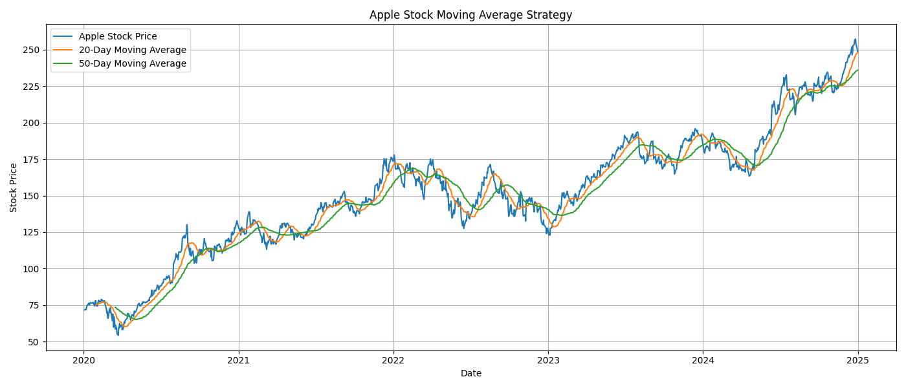
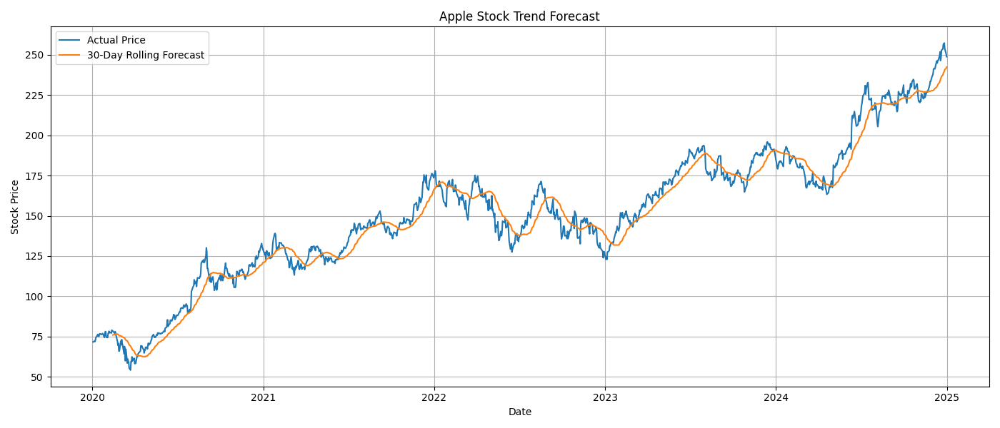
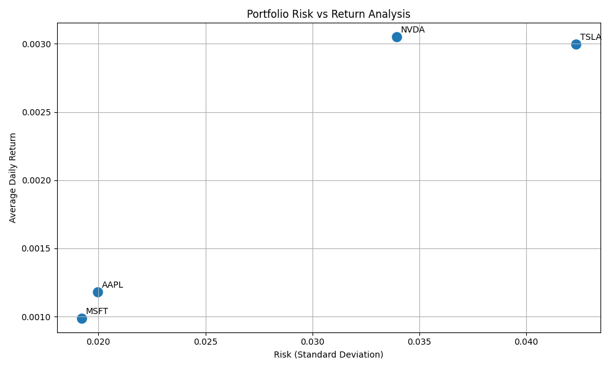

# AlphaPulse – Week 4 Advanced Analytics

## Overview

Week 4 focuses on advanced financial analytics techniques including trend analysis, forecasting, portfolio optimization, and workflow automation.

## Modules Implemented

### Moving Average Strategy
- Calculated 20-Day and 50-Day Moving Averages
- Analyzed Apple stock price trends
- Visualized market momentum using moving average charts

### Stock Forecasting
- Applied 30-Day Rolling Average Forecasting
- Compared actual stock prices with forecasted trends
- Generated forecasting visualization

### Portfolio Optimization
- Calculated average returns and risk (standard deviation)
- Compared risk vs return across multiple stocks
- Visualized portfolio performance using scatter plots

### Automated Pipeline
- Automated execution of analytics modules
- Reduced manual workflow steps

## Technologies Used

- Python
- Pandas
- NumPy
- Matplotlib
- Git & GitHub

## Outputs

### Moving Average Strategy



### Stock Forecasting



### Portfolio Optimization



## Project Structure

```bash
week4_advanced_analytics/
│
├── forecasting/
│   ├── moving_average_strategy.py
│   └── stock_forecasting.py
│
├── portfolio_analysis/
│   └── portfolio_optimization.py
│
├── automation/
│   └── automated_pipeline.py
│
├── outputs/
│
└── README.md
```

---

## Key Insights

- Apple and Microsoft showed relatively stable growth.
- Tesla exhibited higher volatility and risk.
- Moving averages helped identify market trends.
- Risk-return analysis highlighted diversification opportunities.